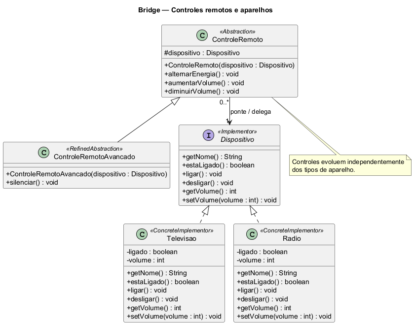

# Bridge — Controles remotos e aparelhos

Projeto acadêmico individual em Java, com aplicação de console, testes JUnit 5 e diagrama de classes. O domínio é uma simulação de controles remotos que operam televisões e rádios.

## O que é o Bridge?

Bridge é um padrão estrutural que separa uma abstração de sua implementação, permitindo que ambas evoluam independentemente. A abstração mantém uma referência para uma interface de implementação e delega operações a ela.

Neste projeto existem duas dimensões: **tipo de controle** (básico ou avançado) e **tipo de aparelho** (televisão ou rádio). Sem essa separação, poderíamos acabar criando classes para cada combinação, como controle básico de TV, avançado de TV, básico de rádio e avançado de rádio. O Bridge evita essa multiplicação.

## Aplicação no projeto

| Papel | Classe/interface | Responsabilidade |
| --- | --- | --- |
| Abstraction | `ControleRemoto` | Oferece ligar/desligar e ajustar volume; mantém a ponte para `Dispositivo`. |
| RefinedAbstraction | `ControleRemotoAvancado` | Herda as operações básicas e acrescenta `silenciar()`. |
| Implementor | `Dispositivo` | Define o contrato para os aparelhos. |
| ConcreteImplementor | `Televisao` | Implementa as operações e mantém o estado de uma TV. |
| ConcreteImplementor | `Radio` | Implementa as operações e mantém o estado de um rádio. |
| Cliente da demonstração | `Main` | Cria e combina os objetos para demonstrar o funcionamento. |

O atributo `protected final Dispositivo dispositivo` é a ponte. Por exemplo, `aumentarVolume()` lê o volume do aparelho e delega o ajuste a `setVolume()`. O controle não precisa saber se opera uma TV ou um rádio.

`Abstraction` é o nome de um papel do padrão: a classe `ControleRemoto` pode ser concreta e representar diretamente o controle básico. A relação entre controle e aparelho é uma associação por referência, não uma herança. Os controles podem compartilhar um aparelho, cujo ciclo de vida é independente deles.

Para acrescentar um projetor, basta criar uma implementação de `Dispositivo`. Para acrescentar outro tipo de controle, basta estender `ControleRemoto` e usar o contrato existente. Não foram acrescentados outros padrões de projeto.

## Regras da simulação

- Cada aparelho inicia desligado e com volume 30.
- O volume fica entre 0 e 100; valores fora da faixa são limitados às extremidades.
- Aumentar ou diminuir altera o volume em 10.
- Silenciar define volume zero e não altera a energia.
- É permitido ajustar o volume mesmo com o aparelho desligado.
- Desligar preserva o volume; silenciar não guarda o volume anterior.
- O construtor rejeita um dispositivo nulo.
- Os aparelhos são simulados em memória; não controlam equipamentos físicos.

TV e rádio têm regras semelhantes de propósito: o foco é entender a estrutura do Bridge.

## Estrutura

```text
bridge-controle-remoto/
├── pom.xml
├── README.md
├── .gitignore
├── .gitattributes
├── docs/
│   ├── diagrama-classes.puml
│   └── diagrama-classes.png
└── src/
    ├── main/java/br/edu/bridge/
    │   ├── Main.java
    │   ├── controle/
    │   │   ├── ControleRemoto.java
    │   │   └── ControleRemotoAvancado.java
    │   └── dispositivo/
    │       ├── Dispositivo.java
    │       ├── Televisao.java
    │       └── Radio.java
    └── test/java/br/edu/bridge/
        └── BridgeTest.java
```

## Compilar, testar e executar

Requisitos: **JDK 17 ou superior** e **Apache Maven 3.9 ou superior**, disponíveis no PATH. A primeira compilação precisa de internet para obter dependências. Execute na pasta que contém `pom.xml`:

```sh
mvn clean verify
java -jar target/bridge-controle-remoto-1.0.0.jar
```

Somente os testes:

```sh
mvn test
```

O projeto usa JUnit Jupiter 5.11.4, Maven Compiler 3.13.0, Surefire 3.5.2 e Jar 3.4.2. O compilador usa `release=17`. Não há dependências de produção.

A demonstração executa o mesmo fluxo para televisão e rádio:

```text
=== Televisao ===
Controle básico: ligar e aumentar volume -> ligado=true, volume=40
Controle avançado: diminuir volume -> ligado=true, volume=30
Controle avançado: silenciar -> ligado=true, volume=0
Controle avançado: desligar -> ligado=false, volume=0

=== Radio ===
Controle básico: ligar e aumentar volume -> ligado=true, volume=40
Controle avançado: diminuir volume -> ligado=true, volume=30
Controle avançado: silenciar -> ligado=true, volume=0
Controle avançado: desligar -> ligado=false, volume=0
```

## Casos de teste

Os testes parametrizados executam os mesmos comportamentos para TV e rádio, incluindo as quatro combinações de controle e aparelho.

| Cenário | Execuções | Resultado esperado |
| --- | ---: | --- |
| Dois controles × dois aparelhos | 4 | Energia alternada, volume aumenta e diminui, desligar preserva volume |
| Limites pelo controle | 2 | Volume nunca ultrapassa 100 nem fica abaixo de 0 |
| Valores extremos diretamente no aparelho | 2 | Valores inteiros extremos são limitados |
| Silenciar repetidamente | 2 | Volume zero, aparelho continua ligado e pode voltar a aumentar |
| Ajuste com aparelho desligado | 2 | Volume muda sem ligar o aparelho |
| Aparelhos independentes | 1 | Operar a TV não altera o rádio |
| Dois controles no mesmo aparelho | 1 | Ambos atuam sobre o mesmo estado |
| Dispositivo nulo | 1 | Ambos os construtores rejeitam a referência |
| **Total** | **15** | |

Os relatórios de execução são gerados em `target/surefire-reports/`.

Consulte [o registro de validação](docs/VALIDACAO.md) para os resultados dos 15 testes e a limitação de acesso encontrada ao executar Maven no ambiente de preparação.

## Diagrama de classes



O código editável está em [docs/diagrama-classes.puml](docs/diagrama-classes.puml). As setas representam herança, implementação de interface e a associação que constitui a ponte. A multiplicidade permite vários controles para um mesmo aparelho.

Para regenerar a imagem com PlantUML 1.2025.2:

```sh
java -jar CAMINHO/plantuml.jar -charset UTF-8 -tpng docs/diagrama-classes.puml
```

O arquivo usa o mecanismo Smetana, dispensando uma instalação separada de Graphviz.

## Roteiro curto para apresentação

1. Explique as duas dimensões: controles e aparelhos.
2. Mostre o contrato `Dispositivo` e suas duas implementações.
3. Mostre o atributo `dispositivo` em `ControleRemoto`: ele é a ponte.
4. Mostre como `ControleRemotoAvancado` adiciona silenciar sem conhecer TV ou rádio.
5. Execute o `Main` e mostre que os mesmos controles funcionam nos dois aparelhos.
6. Execute os testes e explique como adicionar um terceiro aparelho sem modificar os controles.

Frase de apoio: “O controle define as operações oferecidas ao usuário; o dispositivo implementa as operações do aparelho. A composição conecta os dois e permite que evoluam separadamente.”

## Publicação individual no GitHub e prazo

Crie um repositório **exclusivo** para este trabalho, por exemplo `bridge-controle-remoto`. Preencha seu nome e a data limite conforme as orientações da disciplina antes da entrega. Este material foi preparado com auxílio de IA; siga as regras da instituição sobre uso e declaração dessa assistência.

1. Confira o código, execute os testes e confirme a data de entrega.
2. Crie um repositório vazio no GitHub, sem gerar README ou outros arquivos.
3. Abra o terminal **dentro desta pasta**, confira `git status` e use os comandos abaixo, substituindo `SEU_USUARIO`.
4. Verifique no GitHub o código-fonte, os testes e a imagem do diagrama.
5. Entregue o link solicitado pelo professor.

Execute os comandos de commit e publicação **somente antes do prazo**:

```sh
git init
git add .
git commit -m "Implementa Bridge com controles remotos, testes e diagrama"
git branch -M main
git remote add origin https://github.com/SEU_USUARIO/bridge-controle-remoto.git
git push -u origin main
```

A pasta `target/` é ignorada: contém arquivos gerados, não código-fonte. Nenhum commit ou repositório remoto é criado automaticamente por este projeto.

**Depois da data de entrega, não faça novos commits**, nem pela interface do GitHub. Não altere datas de commits. Como o prazo não foi informado, não há bloqueio automático configurado; cumpra a data definida pela disciplina.

## Referências técnicas

- [Documentação do JUnit 5.11](https://junit.org/junit5/docs/5.11.0/user-guide/index.html)
- [Maven Compiler Plugin](https://maven.apache.org/plugins/maven-compiler-plugin/)
- [PlantUML — diagramas de classes](https://plantuml.com/class-diagram)
